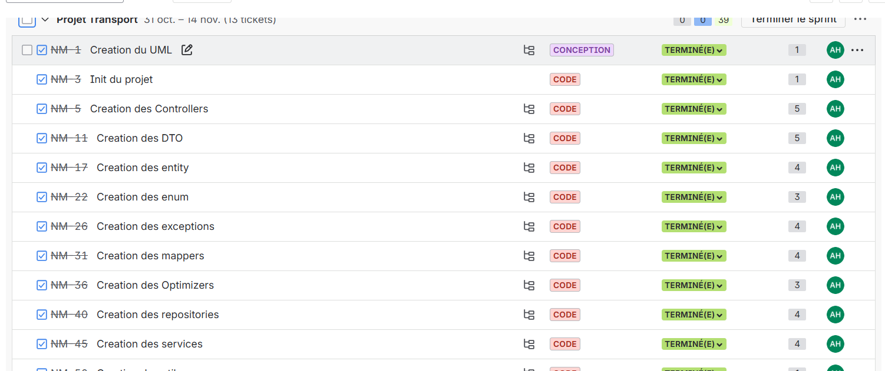
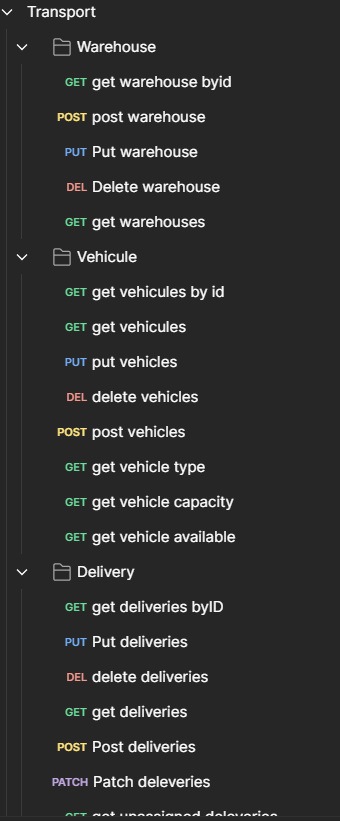

# Transport - Delivery Route Optimization System

## Project Overview
This is a Spring Boot application for managing and optimizing delivery routes using two different algorithms:
- **Nearest Neighbor Algorithm**: Fast but generates longer routes (average ~180km for 100 deliveries)
- **Clarke-Wright Algorithm**: More sophisticated optimization with better distance results

## Technologies Used
- **Java 17**
- **Spring Boot 3.5.7**
- **Spring Data JPA**
- **H2 Database** (in-memory)
- **Lombok**
- **Swagger/OpenAPI** (springdoc-openapi)
- **JUnit 5** for testing
- **SLF4J** for logging

## Key Features
- CRUD operations for Warehouses, Vehicles, Deliveries, and Tours
- Two optimization algorithms (Nearest Neighbor and Clarke-Wright)
- Vehicle capacity constraints (weight and volume)
- Delivery status tracking (PENDING, IN_TRANSIT, DELIVERED, FAILED)
- GPS-based distance calculation using Haversine formula
- RESTful API with proper HTTP methods
- XML-based dependency injection (applicationContext.xml)
- Comprehensive exception handling
- Unit tests with JUnit and Mockito

## Vehicle Types and Constraints
- **BIKE**: Max 15kg, 0.5m³
- **VAN**: Max 800kg, 10m³
- **TRUCK**: Max 3500kg, 40m³

## Project Structure
```
src/
├── main/
│   ├── java/org/example/transport/
│   │   ├── controller/       # REST Controllers
│   │   ├── dto/              # Data Transfer Objects
│   │   ├── entity/           # JPA Entities
│   │   ├── enums/            # Enumerations
│   │   ├── exception/        # Custom Exceptions
│   │   ├── mapper/           # DTO Mappers
│   │   ├── optimizer/        # Tour Optimization Algorithms
│   │   ├── repository/       # JPA Repositories
│   │   ├── service/          # Business Logic
│   │   └── util/             # Utility Classes
│   └── resources/
│       ├── application.properties
│       └── applicationContext.xml
└── test/                     # Unit Tests
```

## Running the Application

### Prerequisites
- Java 17 or higher
- Maven

### Build and Run
```bash
# Build the project
mvn clean install

# Run the application
mvn spring-boot:run
```

The application will start on `http://localhost:8080`

## API Documentation
Once the application is running, access:
- **Swagger UI**: http://localhost:8080/swagger-ui.html
- **API Docs**: http://localhost:8080/api-docs
- **H2 Console**: http://localhost:8080/h2-console
  - JDBC URL: `jdbc:h2:mem:transportdb`
  - Username: `sa`
  - Password: (leave empty)

## Main Endpoints

### Warehouses
- `GET /api/warehouses` - Get all warehouses
- `GET /api/warehouses/{id}` - Get warehouse by ID
- `POST /api/warehouses` - Create warehouse
- `PUT /api/warehouses/{id}` - Update warehouse
- `DELETE /api/warehouses/{id}` - Delete warehouse

### Vehicles
- `GET /api/vehicles` - Get all vehicles
- `GET /api/vehicles/{id}` - Get vehicle by ID
- `POST /api/vehicles` - Create vehicle
- `PUT /api/vehicles/{id}` - Update vehicle
- `DELETE /api/vehicles/{id}` - Delete vehicle
- `GET /api/vehicles/available` - Get available vehicles
- `GET /api/vehicles/type/{type}` - Get vehicles by type

### Deliveries
- `GET /api/deliveries` - Get all deliveries
- `GET /api/deliveries/{id}` - Get delivery by ID
- `POST /api/deliveries` - Create delivery
- `PUT /api/deliveries/{id}` - Update delivery
- `DELETE /api/deliveries/{id}` - Delete delivery
- `GET /api/deliveries/status/{status}` - Get deliveries by status
- `GET /api/deliveries/unassigned` - Get unassigned deliveries
- `PATCH /api/deliveries/{id}/status?status={status}` - Update delivery status

### Tours
- `GET /api/tours` - Get all tours
- `GET /api/tours/{id}` - Get tour by ID
- `POST /api/tours` - Create tour
- `DELETE /api/tours/{id}` - Delete tour
- `POST /api/tours/{tourId}/deliveries/{deliveryId}` - Add delivery to tour
- `GET /api/tours/{id}/optimize?algorithm={NEAREST_NEIGHBOR|CLARKE_WRIGHT}` - Optimize tour
- `GET /api/tours/{id}/distance` - Get total distance
- `GET /api/tours/date/{date}` - Get tours by date
- `GET /api/tours/statistics/average-distance?algorithm={algorithm}` - Get average distance by algorithm

## Example Usage

### 1. Create a Warehouse
```json
POST /api/warehouses
{
  "name": "Main Depot",
  "address": "123 Warehouse St, Paris",
  "latitude": 48.8566,
  "longitude": 2.3522,
  "openingTime": "06:00",
  "closingTime": "22:00"
}
```

### 2. Create a Vehicle
```json
POST /api/vehicles
{
  "registrationNumber": "VAN-001",
  "type": "VAN"
}
```

### 3. Create Deliveries
```json
POST /api/deliveries
{
  "address": "10 Rue de Rivoli, Paris",
  "latitude": 48.8606,
  "longitude": 2.3376,
  "weightKg": 25.5,
  "volumeM3": 1.2,
  "preferredTimeSlot": "09:00-11:00"
}
```

### 4. Create a Tour
```json
POST /api/tours
{
  "tourDate": "2024-10-27",
  "vehicleId": 1,
  "warehouseId": 1
}
```

### 5. Add Deliveries to Tour
```
POST /api/tours/1/deliveries/1
POST /api/tours/1/deliveries/2
POST /api/tours/1/deliveries/3
```

### 6. Optimize the Tour
```
GET /api/tours/1/optimize?algorithm=CLARKE_WRIGHT
```

## Design Patterns Used
- **Repository Pattern**: Data access abstraction
- **DTO Pattern**: Separation of domain and presentation layers
- **Mapper Pattern**: Converting between entities and DTOs
- **Strategy Pattern**: Different optimization algorithms (TourOptimizer interface)
- **Dependency Injection**: XML-based configuration (Open/Closed Principle)

## XML-Based Dependency Injection
The project uses XML-based dependency injection via `applicationContext.xml` to demonstrate:
- **Open/Closed Principle**: Application is closed for modification but open for extension
- Easy switching between different optimizer implementations
- No use of `@Autowired`, `@Service`, `@Component` annotations for business logic

## Testing
Run tests with:
```bash
mvn test
```

Tests include:
- Unit tests for services (with Mockito)
- Optimizer algorithm tests
- Distance calculation tests

## Logging
The application uses SLF4J for logging. Log levels can be configured in `application.properties`.

## Notes
- The H2 database is in-memory and resets on application restart
- Delivery statuses are updated manually (not automatically)
- Distance calculations use the Haversine formula for GPS coordinates
- Vehicle capacity constraints are enforced when adding deliveries to tours

## Author
Transport Delivery Optimization System - Java 17 & Spring Boot Project

## Jira


## Postman

